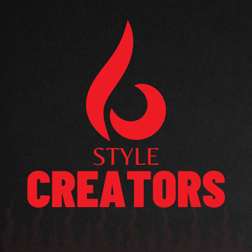

<h1 align="center"> Style Creators </h1>

  

## Team Members
<ul>
  <li>Scrum Trainer - Кристиян Дараджанов (9B)</li>
  <li>Back-end Developer - George Yankov (9G)</li>
  <li>Front-end Developer - Емануил Тинчев (9A)</li>
  <li>Designer - Stoyan Vasilev (9V)</li>
</ul>

## About our project

The whole website point is to help people understand more about fires, fire department crews, the closest fire stations to a given location and much more!

Fires (or any other incidents) are something that we tend to ignore, and we shouldn't!

People generally don't pay attention to any incidents with the idea that "it's unlikely to happen to them" - No!

It would never hurt someone to be more familiar with what to do in emergency situations.

<b>And you, are you like most people who would panic in such a situation or would you inform yourself a little bit more just in case?</b>

## Technologies 
<ul>
  <li> Power Point </li>
  <li>Word </li>
  <li>Visual Studio Code </li>
  <li>Teams</li>
</ul>

## Presenting 
<a href="#" target="_blank">  Documentation </a>

<a href="https://codingburgas-my.sharepoint.com/:p:/g/personal/kgdaradjanov23_codingburgas_bg/EdzwUkv-2SJCm6gk63LTpy8BnRpievGmeZhSMz0kJaDnLA" target="_blank">
 Presentation </a>